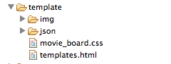

## 1. Afficher les données d'un film (titre, poster, date de sortie)
> **Objectifs :** _Comprendre la structure principale d'un projet Dart, Apprendre à créer un composant web avec Polymer, Effectuer le binding sur un objet métier, Utiliser Polymer Expressions et les filtres, Créer sa 1ère closure en Dart_  
  
    
  
  *Résultat obtenu à la fin de ce chapitre*
  
###Premiers pas...###

1. Commencez par lancer Dart Editor et ouvrez le répertoire `movie-board` (dans lequel vous avez décompressé l'archive) et explorez la structure du projet (ces éléments sont les éléments standards que vous retrouverez lorsque vous créez une nouvelle application Polymer en partant d'un exemple):

    
  
  - Ouvrez le fichier `pubspec.yaml`: il contient les dépendances du projet ainsi que des indications sur comment compiler celui-ci

  ```
   dependencies:  
        polymer: any  
      transformers:  
        - polymer:
          entry_points: web/movie_board.html
  ```
> **Conseil** Si vous souhaitez renommer votre point d'entrée `movie_board.html` en `index.html`par exemple, pensez bien à modifier votre fichier `pubspec.yaml` afin de modifier la valeur de `entry_points` sinon `dart2js` ne sera pas capable de compiler votre code Dart en Javascript.       
    
  - `build.dart` est le script Dart qui est lancé après une sauvegarde et permet d'afficher les warning dans l'éditeur
    
  - `clickcounter.html` et `clickcounter.dart` représente un composant personnalisé nommé `click-counter`. Ouvrez ces 2 fichiers.  
      _Nous ne nous servirons pas de ces fichiers mais gardez les à titre d'exemple !_
  
      ```
      <polymer-element name="click-counter" attributes="count">
        <template>
          <!-- Custom element body -->
        </template>
        <script type="application/dart" src="clickcounter.dart"></script>
      </polymer-element>
      ```
  
      ```
      import 'package:polymer/polymer.dart';
      @CustomTag('click-counter')
      class ClickCounter extends PolymerElement {
        ClickCounter.created() : super.created();
      }
      ```
	  
  `clickcounter.html` importe `clickcounter.dart` (à travers le tag script) et ces 2 fichiers forment le composant car ils partagent le même nom : `click-counter`
  
> **Note:** Le nom d'un composant doit toujours être composé de la façon suivante `xxx-yyy`(le tiret entre 2 mots est nécessaire)    
  
  - `movie_board.html` importe le composant `click-counter` afin de pouvoir l'utiliser et initialise Dart et Polymer    

  
      ```
      <head>
        <link rel="import" href="clickcounter.html">
        <script type="application/dart">export 'package:polymer/init.dart';</script>
        <script src="packages/browser/dart.js"></script>
      </head>
      <body>   
        <click-counter count="5"></click-counter>
      </body>
      ```
  - Effectuez un clic-droit sur `movie_board.html` et sélectionnez `Run in Dartium`et testez l'application  
  
  - Le répertoire `packages`contient les packages Dart que vous utilisez dans votre projet.  
  
      
  
  - Les autres répertoires (user-story-X, template, docs) sont des répertoires utiles à ce codelab mais non présents dans une application par défaut. Certains seront utilisés au cours de ce codelab.  
  **ATTENTION :** Le répertoire `user-story-final` contient l'application finalisée, ne regardez pas le contenu de ce répertoire !!!
  
> **Astuce :** Sachez que si vous êtes perdu, vous pouvez toujours récupérer le contenu d'un des répertoires `user-story-X`. Ces répertoires contiennent le résultat typique que vous devez obtenir à la fin d'une user story.  
  
  
###Votre 1er composant...###

1. Copiez tous les fichiers du répertoire `template`(sauf le fichier `template.html`) dans le répertoire `web` de votre projet  
  
   

2. Créez un nouveau composant nommé `movie-poster`  
   - Créez les fichiers `poster.html` et `poster.dart` et prenez exemple sur le composant `click-counter`  
   
   - Ouvrez le fichier `template/template.html` et copiez le bloc **POSTER TEMPLATE** dans le corps de votre composant  
     
3. Importez le composant `movie-poster` dans le fichier `movie_board.html` et utilisez le composant :  
  
    ```
    <body>
      <movie-poster></movie-poster>
    </body>
    ```
4. Rafraichissez Dartium (vous n'êtes pas obligé de le relancer systématiquement: un simple refresh suffit à la mettre à jour avec vos dernières modifications de code) et vous devriez obtenir ce résultat ! Passez la souris sur l'affiche pour voir les détails du film...  [Ca ne marche pas ?](#user-story-1-hints)
     
    
   
   **Note** : un composant peut définir son propre style ou utiliser le style de son parent. dans notre cas, pensez à définir votre composant comme utilisant le style de son père :
   ```bool get applyAuthorStyles => true; ``` 
        
5. Copiez plusieurs fois le tag du composant dans le fichier `movie-board.html` et rafraichissez Dartium. Cool non ?  
    
 **Bravo ! Vous venez de réaliser votre 1er composant**  
  
###Ajoutons des données dynamiques...###
    
1. Créez le fichier `models.dart` 
  
2. Dans ce fichier créez la classe `Movie` comprenant les propriétés suivants:  
   - int `id` 
   - String `title` 
   - String posterPath` 
   - String `releasedDate` 
   - int `voteAverage` 
   - int `voteCount` 
   
3. Ajoutez un constructeur nommé `sample`et dans ce constructeur initialisez les propriétés avec les valeurs de vos choix (vous pouvez utiliser comme valeur de `posterPath`l'image `img/dart-flight-school.jpg`)  
  
    ```
    class Movie {
      Movie.sample() {
        id=1;
        title='Dart is really cool !';
        ...
      }
    }
    ```
4. Dans la classe `Poster`, ajoutez une propriété `movie` que vous initialisez avec le constructeur nommé que vous venez de créer 
  
    ```
    @observable Movie movie = new Movie.sample();
    ```
5. Dans le fichier `poster.html`, remplacez `title` par l'expression Polymer `{{movie.title}}` et rafrachissez votre navigateur  
  
6. Remplacez les valeurs statiques restantes avec des expressions Polymer en utilisant les différents attributs définis dans la classe `Movie`.
  
    > **Note:** Polymer utilise le pattern MDV (Model Driven View), ce qui signifie que la vue (le fichier HTML) est pilotée par le modèle (le fichier dart). Si la valeur d'une propriété du modèle est modifiée, la vue (ou une partie de la vue) est rafraichie afin de refléter la nouvelle valeur. La réciproque est vraie aussi : si vous saisissez une valeur dans un input, la valeur du modèle est modifiée. Cette liaison entre le modèle et la vue est effectuée grâce à l'annotation `@observable`
    
    **Important** Le code que vous venez d'écrire fonctionne dans Dartium mais ne marchera plus une fois compilé en Javascript !!! Dart2Js effectue à des fins d'optimisation du `tree shaking` qui consiste à supprimer tout le code qui n'est pas utilisé. Or les Polymer expressions ne sont pas prises en compte pour le `tree shaking`, vous devez donc indiquer dans votre code que vos attributs sont observables grâce à l'annotation `@observable` et votre classe `Movie` doit étendre (ou utiliser le mixin) `Observable` :
  
    ```
class Movie extends Observable {
  @observable int id;
  @observable String title;
  ...
}
```
7. Pour afficher le vote moyen sous forme d'étoile, vous allez utiliser un filtre. Un filtre est une fonction qui possède un seul paramètre (la valeur) et retourne une autre valeur (qui peut être d'un autre type). Son utilisation est la suivante :
    ```
    {{ movie.voteAverage | asStars }}
    ```  
    [Voir les Polymer Expressions](http://pub.dartlang.org/packages/polymer_expressions)  
    
    _Ici le vote moyen (de type `int`) est passé en paramètre de la fonction `asStars`._
        
    Ajoutez une méthode à la classe `Poster` qui prenne en paramètre un `int` et qui retourne une chaine. Utilisez les méthodes `List.generate`et `List.join` pour créer votre chaîne en utilisant le caractère étoile : `\u2605`  
    [Documentation de l'API List](https://api.dartlang.org/docs/channels/stable/latest/dart_core/List.html)

8. Pour rendre cette méthode utilisable ailleurs que dans la classe `Poster`, créez le fichier `utils.dart`. Dans ce fichier créez une variable globale `intAsStars` de la façon suivante:  

    ```
    Function intAsStars = (int nb) => // Votre code pour la génération des étoiles
    ```
    Modifiez la fonction `asStars`de la classe `Poster` en un attribut de type `Function` et en l'affectant à la fonction `intAsStars`. Vous pouvez maintenant réutiliser facilement cette fonction dans d'autres classes.  
    Vérifiez le bon fonctionnement en rafraichissant Dartium. 

  
###Vous êtes en avance sur le timing : voici un bonus !###

Le vote moyen étant sur 10, utilisez les techniques apprises précédemment afin de faire un complément à 10 et affichez le nombre d'étoiles manquantes pour avoir la note maximum dans le 2ème tag ```<span>```.  

Pour mettre un peu de piment, essayez de ne pas faire une fonction figée qui fasse toujours le complément à 10 ! Essayez plutôt d'utiliser une closure afin de rendre paramétrable la valeur du complement.

[Voir 'Dart - Functions are fun'](https://www.dartlang.org/dart-tips/dart-tips-ep-7.html) et cherchez sur cette page la fonction `makeAdder` pour un exemple sur les closures en Dart.  

  
  [Passez à la user-story n°2](user-story-2.md)


****
    
<a name="user-story-1-hints"></a>
> **Astuces:**  
>
> - Si votre composant n'affiche rien, vérifiez que les fichiers utilisent le même nom de composant et vérifiez que votre fichier dart est bien importé dans le fichier HTML (sinon vous aurez une belle page vide)  
>
> - Pour pouvoir utiliser un composant dans une page HTML ou dans un autre composant, vous devez importer le fichier HTML de ce composant :   
>
>  ```
>   <link rel="import" href="poster.html">
>   ``` 
>      
> -  Pour appliquer les styles définis au niveau document sur contenu d'un composant, vous devez ajouter le getter suivant à votre classe Dart (par défaut seuls les styles définis dans le composant sont appliqués à son contenu): 
>
>   ```
>   bool get applyAuthorStyles => true;
>   ```  
>
> -  Si une classe est indiquée comme non définie, cela signifie que vous le l'avez pas importée : `import <fichier dart>;` 
>
> -  Pour utiliser les classes définies dans Polymer vous devez effectuer un import  
>
>   ```
>   import 'package:polymer/polymer.dart';
>   ```
> -  Tous les fichiers Dart se trouve dans une librairie et sans définition ils se trouvent dans la librairie par défaut. Dart Editor vous affichera un warning si vous essayez, depuis un même fichier, d'importer 2 fichiers se trouvant dans la même librairie. Pour éviter ce warning, vous devez ajouter une entête dans chaque fichier Dart définissant le nom de la librairie:  
>    
>    ```
>    library <nom de la librairie>;  
>    // Par exemple  
>    library movie.utils;  
>    ```  


