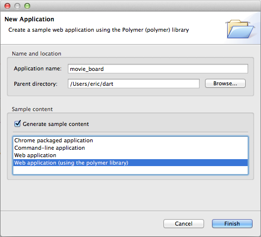

## 1. Show a movie's content (poster, title, average rating, ...)
> **Goal** _As a user, I want to see the poster, the title, the average rating and vote count of movie_  

  
1. Start by creating a new Polymer application named `movie-board`
  - Fill the _application name_ and select _Web application (using the polymer library)_  

  
  
  - Open `pubspec.yaml`: it includes project's dependencies and build's tranformers  
  ```YAML   
    dependencies:  
      polymer: any  
    transformers:  
      - polymer:  
        entry_points: web/movie_board.html  
  ```  
  
  **Tip** : If you want to rename the main entry point of your application (ie `movie_board.html`) to something else like `index.html`, remember to modify `entry_points` in `puspec.yaml` to reflect the new name, otherwise `dart2js` will fail.