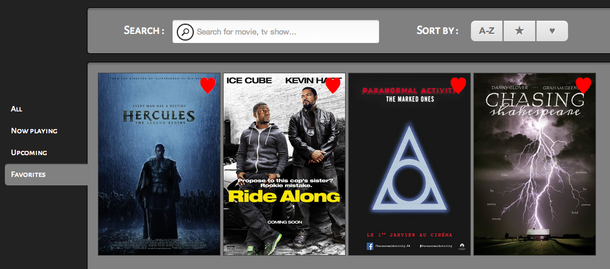

##Gérer les favoris et les catégories de films


> **Objectifs :**  
  - Gérer des clic utilisateurs avec une seule méthode et déterminer quel élément a été cliqué
  - Effectuer des filtres sur des listes  
  - Appliquer une classe CSS en fonction de la valeur d'un attribut du modèle 
  - Bonus : Déclencher un evénement custom et le gérer dans le composant parent   
  
  
  *Résultat obtenu à la fin de ce chapitre*

###Gérer les catégoris de films

1. Dans le fichier `posters.html, ajoutez le code suivant au dessus du `div id='movies'` :  
  
  	```
    <div id="menu" class="menu">
      <div class="item item-selected">All</div>
      <div class="item">Now playing</div>
      <div class="item">Upcoming</div>      
      <div class="item">Favorites</div>      
    </div>
  	```
  
2. Pour chaque `div` du menu, ajoutez la gestion du `on-click` qui appellera la méthode `showCategory` que vous implémenterez 
  
  	> **Astuces :**  
  	>
  	> - Vous pouvez soit ajouter un `id` sur chaque `div` ou utiliser un attribut `data-menu` pour passer une chaine permettant de caractériser le menu qui vient d'être cliqué
  	> 
  	> - Appelez la fonction `applySelectedCSS` (de `utils.dart`) dans la méthode `showCategory` afin de faire changer le menu d'état
  	>
  	> - Vérifiez dans Dartium que votre menu change bien d'état
   
3. Ajoutez dans votre service la méthode `getMovies(String tag)` qui retournera la liste des films ayant un certain type de tag  
   
   > **Astuces :**  
   >  
   > - Dans votre implémentation du service, filtrez les films contenus dans l'attribut privé `_movies` 
   >
   > - Retournez `new Future(() => // your filtered result);`. Cette technique permet de retourne un `Future`contenant déjà le résultat
   >
   > - Quand vous utilisez une méthode retournant une `LazyIterable`, il faut appeler la méthode `toList` pour forcer le code à parcourir la liste
   
4. Dans la méthode `showCategory`, en fonction du menu sélectionné appelez les méthodes  :
	- `getAllMovies`  
	- `getMovies('now_playing')`
	- `getMovies('upcoming')`
	
	et affectez le résultat à `movies`.  
	
	> **Note :** Utilisez ce type de code pour appeler la bon service :  
	> 
	>   ```
	>   switch(<variable>) {  
	> 	  case <case1>: <your code>; break;   
	>	  case <case2>: <your code>; break;   
	>   }
	>   ```
	
   Validez que lors d'un clic sur l'un menu, la liste des films affichés est modifiée
   
###Gérer les favoris

1. Dans le fichier `poster.html`, modifiez le `span` gérant l'icone favori de la façon suivante :  
	
	```
	<span class="{{ movie.favorite | asFavoriteClass }}"  ...
	```
	
	`asFavoriteClass`est une fonction attendant un `bool` en paramètre et qui renverra une `String` contenant la classe CSS en fonction de la valeur du boolean  
	
	> **Note :** En faisant ainsi, toutes modifications de la valeur de `movie.favorite` sera répercutée sur la vue
	
2. Dans le fichier `utils.dart`, ajoutez la fonction `selectedToClass(String prefix)`  
	
	Cette fonction générique renvoie à partir d'un prefix une fonction qui :  
	- renvoie `<prefix>-selected` si le boolean est `true`
	- renvoie `<prefix>`si la boolean est `false`
	
	> **Astuce :** Reportez vous au code de la fonction `intToStars`
	
3. Dans la classe `Poster`, définissez un attribut de type `Function` appelé `asFavoriteClass` et affectez ce dernier à l'appel de la fonction `selectedToClass('favorite')` 

4. Gérez le `on-click` sur le `<span>` de l'icone favori. Dans la méthode, de la classe `Poster` gérant le click, inversez la valeur de `movie.favorite` et vérifiez dans Dartium que l'état de l'icone change bien à chaque clic utilisateur.

5. Dans l'interface `MovieService`, ajoutez une méthode `getFavorites()` et implémentez cette méthode en filtrant les films contenus dans `_movies` dont la propriété `favorite` est à `true`

6. Dans la méthode `showCategory` de la classe `Posters` rajoutez le cas de la gestion du menu `favori` et utilisez la nouvelle méthode du service pour affecter les films visibles

**A ce stade vous devriez pouvoir ajouter un film dans vos favoris et pouvoir visualiser la liste de vos favoris**
	
##Bonus : enlever un favori depuis la liste des favoris

*Si vous ajoutez un film dans vos favoris et vous visualisez ensuite la liste de vos favoris, le film nouvellement ajouté apparaît. Pourtant si depuis la liste de vos favoris, vous cliquez à nouveau sur l'icone celui-ci affiche bien son nouvel état MAIS le film n'est pas enlevé de la liste*  
  
1. Dans la méthode `flipFavorite` de la classe `Poster`, déclenchez grâce à la méthode `PolymerElement.dispatchEvent` un evénement personnalisé (`CustomEvent`) : 
  
  - Utilisez comme type du `CustomEvent`, la valeur `movieupdated`
  
  - Utilisez le paramètre nommé `detail`, du constructeur de `CustomEvent`, pour passer le film
  
  	> **Note :** Attention le nom du type de l'evénement DOIT être en minuscule  
  
  	Vous devriez être capable d'écrire la méthode `flipFavorite` sur une seule ligne ! Pensez à l'opérateur cascade ;-)
    
    [PolymerElement API](https://api.dartlang.org/docs/channels/stable/latest/polymer/PolymerElement.html)  
    [CustomEvent API](https://api.dartlang.org/docs/channels/stable/latest/dart_html/CustomEvent.html)  
   
2. Dans `posters.html` ajoutez dans le tag `<movie-poster>` la gestion de l'evénement `on-movieupdated` comme vous l'auriez fait pour l'evénement `on-click`... 

3. Ajoutez une méthode `movieUpdated` (qui sera appelée lorsque l'evénement `on-movieupdated` sera déclenché) dans la classe `Posters` et implémentez le code qui va :  

	- Vérifier que c'est bien le menu favori qui est actuellement affiché
	
	- Supprimer de la liste des films, le film passé en paramètre de `detail`
	
	> **Astuce :**  
	>
	> Dans la méthode `movieUpdated` vous pouvez directement utiliser `Movie` comme type du paramètre `detail` (plutôt que d'utiliser `Element`) puisque c'est toujours une instance de `Movie` qui sera utilisé comme détail de cet evénement personnalisé.
  
  
  
###[Prochaine user-story >>>](user-story-5.md)
   
